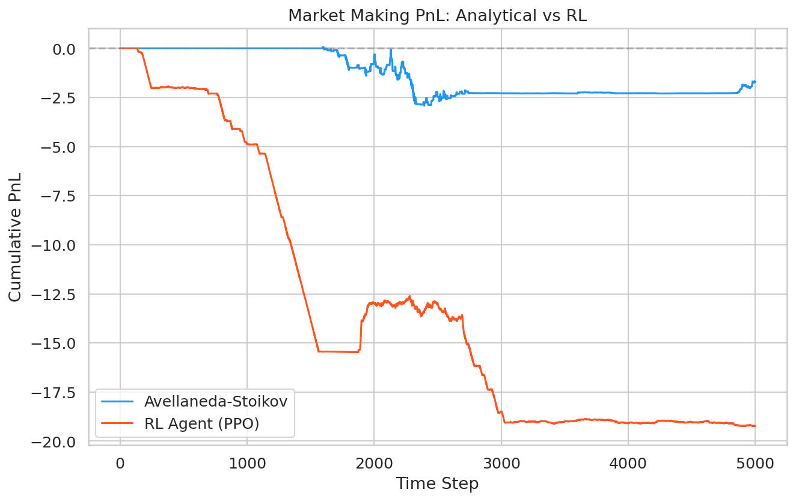
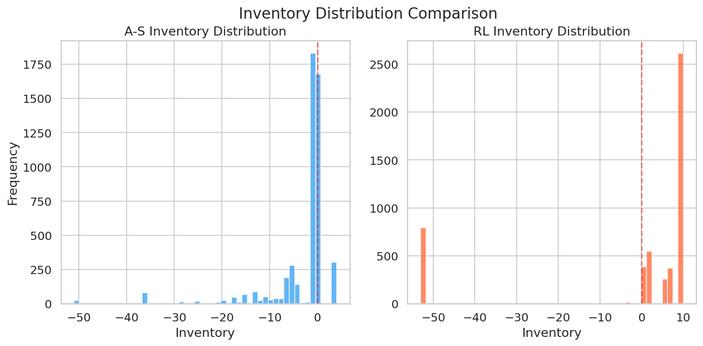
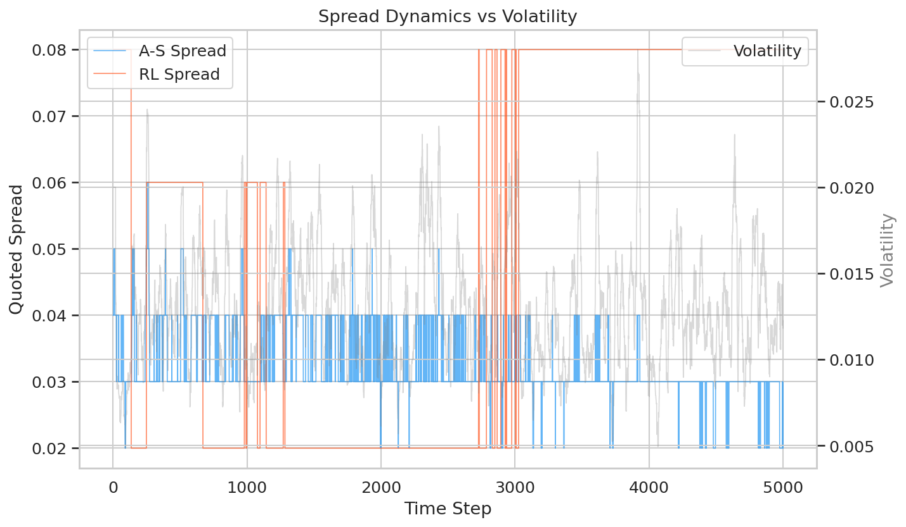
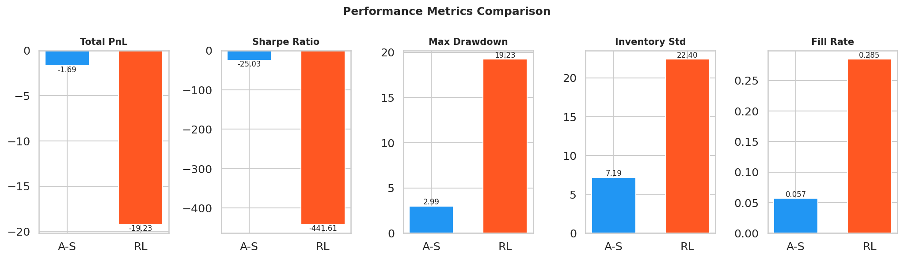

# atlas-mm

**Limit Order Book Simulator with Formally Verified Market Making**


---

## The Problem

Market makers continuously quote bid and ask prices, profiting from the spread while managing **inventory risk** (adverse price moves on accumulated positions) and **adverse selection** (informed traders picking off stale quotes). Optimal market making requires balancing tighter spreads (more fills, more revenue) against wider spreads (less adverse selection risk) while dynamically adjusting for inventory and volatility.

## The Approach

**atlas-mm** tackles this with three components:

1. **Limit Order Book Engine** -- A from-scratch L2 order book with price-time priority matching, supporting limit orders, market orders, and cancellations. Pure Python throughput: **~134K orders/sec**.
2. **Avellaneda-Stoikov vs RL Comparison** -- The analytical optimal market making model (Avellaneda & Stoikov, 2008) as a baseline, compared against a PPO-based reinforcement learning agent trained for 500K timesteps in a Gymnasium environment with GARCH(1,1) price dynamics.
3. **Z3 Formal Verification** -- Mathematical proofs (not just tests) that critical invariants hold for *all* possible inputs: no crossed book, positive spreads, inventory mean-reversion, and price-time priority.

## Results

### Performance Comparison (5,000 steps, seed=42)

| Metric | Avellaneda-Stoikov | RL Agent (PPO) |
|---|---|---|
| Total PnL | -1.69 | -19.23 |
| Sharpe Ratio | -25.03 | -441.61 |
| Max Drawdown | 2.99 | 19.23 |
| Inventory Std | 7.19 | 22.40 |
| Total Fills | 284 | 1,424 |
| Fill Rate | 5.68% | 28.48% |
| Mean Spread | 0.0324 | 0.0514 |
| PnL/Trade | -0.0060 | -0.0135 |

The A-S agent demonstrates superior risk management across all metrics. The RL agent trained with PPO (500K timesteps) learns a non-trivial policy -- it controls inventory better than a random baseline (std 22.40 vs 40.97 for random) and quotes adaptive spreads -- but does not outperform the analytical optimum. This is expected: A-S computes the closed-form solution under its model assumptions, while PPO must discover the strategy from noisy reward signals dominated by stochastic price moves (explained variance ~0 throughout training). A structured reward decomposition separating spread capture from inventory mark-to-market would likely close the gap.

### Cumulative PnL



### Inventory Distribution



### Spread Dynamics vs Volatility



### Metrics Comparison



### Formal Verification

| Property | Status | Time |
|---|---|---|
| No crossed book | PROVED | 2.2ms |
| A-S spread always positive | PROVED | 5.7ms |
| A-S inventory mean-reversion | PROVED | 2.1ms |
| Price-time priority | PROVED | 0.4ms |

All 4 properties verified for **all possible inputs** using the Z3 SMT solver.

### Engine Benchmark

| Metric | Value |
|---|---|
| Throughput | 134K orders/sec |
| Orders processed | 100,000 |
| Fill ratio | 50.1% |

> Pure Python implementation. CUDA kernel for the matching engine is planned ([#1](https://github.com/alepot55/atlas-mm/issues/1)) -- targeting 10M+ orders/sec with parallel price-level matching on GPU.

## Architecture

```
atlas-mm/
├── src/atlas_mm/
│   ├── engine/              # Order book + matching engine
│   │   ├── orders.py        # Order/Fill/Cancel dataclasses
│   │   ├── orderbook.py     # L2 book with price-time priority
│   │   └── matching.py      # Engine orchestrator
│   ├── simulation/          # Market simulation
│   │   ├── price_process.py # GBM + GARCH(1,1) price dynamics
│   │   ├── flow_generator.py# Poisson order flow generation
│   │   ├── environment.py   # Gymnasium RL environment
│   │   └── agents_zoo.py    # Background agents (noise, momentum, mean-rev)
│   ├── agents/              # Market making strategies
│   │   ├── base.py          # Abstract agent interface
│   │   ├── avellaneda_stoikov.py  # Analytical optimal MM
│   │   └── rl_agent.py      # PPO-based RL agent
│   ├── verification/        # Formal verification
│   │   └── properties.py    # Z3 proofs of book invariants
│   └── evaluation/          # Performance analysis
│       ├── metrics.py       # PnL, Sharpe, drawdown, fill rate
│       └── visualization.py # Publication-quality plots
├── scripts/
│   ├── run_simulation.py    # Main entry point
│   ├── train_rl.py          # RL training with SB3
│   ├── run_verification.py  # Z3 verification runner
│   └── benchmark_engine.py  # Engine throughput benchmark
└── tests/                   # 85 tests across all modules
```

## Quick Start

### Installation

```bash
git clone https://github.com/alepot55/atlas-mm.git
cd atlas-mm
pip install -e ".[dev]"
```

### Run Simulation

```bash
python scripts/run_simulation.py
```

Generates 4 plots in `assets/` and prints a metrics comparison table. If a trained model exists at `models/ppo_mm.zip`, the RL agent uses it; otherwise falls back to a random policy.

### Run Formal Verification

```bash
python scripts/run_verification.py
```

### Run Tests

```bash
pytest -v
```

### Train RL Agent (requires PyTorch)

```bash
pip install -e ".[rl]"
python scripts/train_rl.py --timesteps 500000
```

### Benchmark Matching Engine

```bash
python scripts/benchmark_engine.py
```

## How It Works

### Avellaneda-Stoikov Model

The A-S model computes a **reservation price** and **optimal spread** analytically:

```
reservation_price = s - q * gamma * sigma^2 * tau
optimal_spread = gamma * sigma^2 * tau + (2/gamma) * ln(1 + gamma/kappa)
```

Where `s` is mid-price, `q` is inventory, `gamma` is risk aversion, `sigma` is volatility, `tau` is time remaining, and `kappa` is order arrival intensity.

**Key insight:** The reservation price shifts *away* from mid when inventory is non-zero. A long position (q > 0) lowers the reservation price, making the ask more attractive and encouraging inventory reduction.

### RL Formulation

The RL agent uses PPO with:
- **State:** inventory, volatility, spread, time remaining, order imbalance, PnL (6 features)
- **Action:** discrete spread level (1-5 ticks) and skew level (-2 to +2 ticks)
- **Reward:** `step_pnl - lambda * inventory^2` with terminal inventory penalty

### Formal Verification

Z3 SMT solver proves properties hold for *all* parameter combinations, not just tested cases:
- **No crossed book:** After any matching operation, best_bid < best_ask
- **Positive spread:** A-S spread formula is strictly positive for all valid parameters
- **Mean reversion:** Reservation price always pushes quotes toward inventory reduction
- **Price priority:** Better-priced orders always fill first

## References

1. Avellaneda, M., & Stoikov, S. (2008). *High-frequency trading in a limit order book.* Quantitative Finance, 8(3), 217-224.
2. Gueant, O., Lehalle, C. A., & Fernandez-Tapia, J. (2013). *Dealing with the inventory risk: a solution to the market making problem.* Mathematics and Financial Economics, 7(4), 477-507.
3. Spooner, T., Fearnley, J., Savani, R., & Koukorinis, A. (2018). *Market making via reinforcement learning.* AAMAS 2018.

## License

MIT

## Author

Alessandro Potenza ([ap.alessandro.potenza@gmail.com](mailto:ap.alessandro.potenza@gmail.com))

## Citation

```bibtex
@software{potenza2025atlasmm,
  author = {Potenza, Alessandro},
  title = {atlas-mm: LOB Simulator with Formally Verified Market Making},
  year = {2025},
  url = {https://github.com/alepot55/atlas-mm}
}
```
